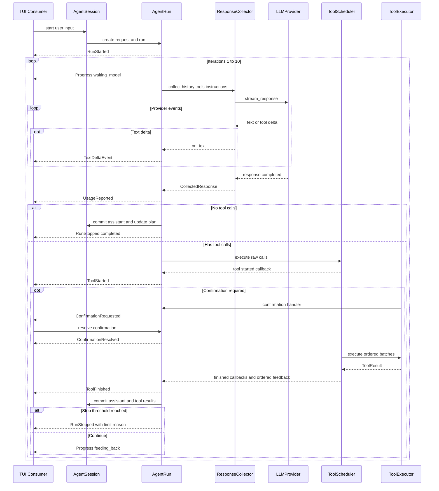
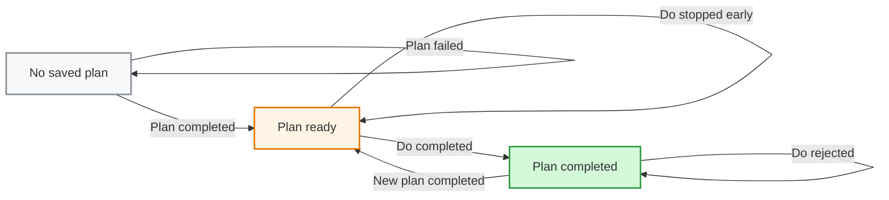

# MewCode Agent Loop Plan

## 架构概览

采用“会话状态层 + 单次运行层 + 异步 Provider 层 + 工具调度层 + 被动界面层”的结构。核心边界是 `AgentRun`：对外只提供统一异步事件流和取消/确认控制，不暴露内部循环状态。

```text
用户输入
   │
   ▼
AgentSession
  - 解析普通请求、/plan、/do
  - 持有会话历史与当前计划
   │
   ▼
AgentRun ───────────────────────────────┐
  - ReAct 循环                         │ 控制入口
  - 轮次、用量、停止条件               │ cancel / resolve confirmation
  - 有界事件通道                       │
   │                                   │
   ├── ResponseCollector ──→ Provider  │
   │      实时转发文本        异步 SSE │
   │      收集完整响应        用量归一化│
   │                                   │
   └── ToolScheduler ──→ ToolExecutor  │
          保序分批          异步工具    │
          并发/串行          确认与超时  │
   │                                   │
   └──────── Async AgentEvent Stream ──┘
                  │
          ┌───────┴────────┐
          ▼                ▼
    Cyberpunk TUI      Plain TUI
```

### 依赖方向

`mewcode.cli` 是唯一组合根，负责创建具体 Provider、工具、Agent 和界面。其余依赖只沿以下方向流动：

```text
TUI ──→ Agent 公共接口
Agent ──→ Provider 抽象 + 工具公共接口 + messages/cancellation
具体 Provider ──→ Provider 基础 + messages + tools.base + cancellation
工具注册/执行/实现 ──→ tools.base + workspace + cancellation
messages / tools.base / cancellation ──→ 标准库与领域错误
```

下层模块不反向导入 `agent`、`tui` 或 `cli`：Provider 不知道 Agent Loop，工具执行器不依赖 Agent 事件，界面也不直接依赖 Provider 或具体工具。`ToolScope`、工具调用与反馈类型归属 `tools.base`，会话消息归属 `messages`，取消语义归属 `cancellation`，因此依赖图保持无环。

### 会话状态层

新增 `AgentSession` 作为 CLI 会话的唯一状态所有者，负责：

- 解析普通输入、`/plan <任务>` 和 `/do`。
- 保存协议完整的会话历史。
- 保存最新计划及其“可执行/已完成”状态。
- 为每次请求创建唯一的 `AgentRun`。
- 保证同一会话同时最多运行一个请求。
- 为三种模式生成不同的运行指令与工具视图。

计划只有在规划自然完成后才替换；执行自然完成后标记完成，其他停止原因恢复为可重试。

### 单次运行层

每个 `AgentRun` 拥有独立的运行标识、取消状态、确认请求、事件序号、Token 累计值和有界事件通道。

运行逻辑在后台异步任务中推进，界面通过异步迭代器消费事件。所有内部组件都向同一通道发布事件；通道负责总排序、背压和唯一终止事件。消费者停止读取或应用退出时，运行任务及未决确认会被取消。

每轮助手响应和对应工具结果作为一个历史提交单元：完整批次结束后一起提交；响应流或工具批次中途取消时，不留下孤立调用或部分结果。

### 响应收集层

`ResponseCollector` 位于 Agent Loop 与 Provider 之间：

- 一边把文本增量立即发布为 Agent 事件。
- 一边按调用槽位收集工具名称、调用标识和参数。
- 验证唯一完成信号并保存不透明 Provider 状态。
- 收集 Provider 返回的真实 Token 用量。
- 仅在流完整结束后返回完整响应。

Provider 继续负责协议差异。OpenAI 与 Anthropic 均改为异步 HTTP/SSE；各自累积原生 usage 字段，再在完成事件中输出统一用量。字段不存在时保留为不可用，不进行估算。

### 工具调度层

`ToolScheduler` 负责：

- 把完整响应中的每个调用独立解析。
- 查询工具的只读属性和执行策略。
- 将相邻可并发调用组成批次，将串行调用作为屏障。
- 使用异步任务组运行并发批次。
- 按实际完成时间发布工具事件，但按模型原始顺序组织反馈。
- 计算连续未知工具轮次。

`ToolExecutor` 继续集中处理 Schema 校验、准备、确认、超时、异常转换、截断和脱敏，但不再直接调用界面。确认通过运行控制入口等待，开始、确认和结果都由 `AgentRun` 发布到统一事件流。

### 被动界面层

全屏与纯文本界面都只消费 `AgentEvent`：

- 全屏界面改用 Textual 异步 Worker，不再使用 `thread=True`、线程锁或 `TuiEventBridge`。
- 纯文本界面改为异步运行循环。
- 两种界面遇到确认事件时展示现有确认 UI，再通过当前 `AgentRun` 回传决定。
- 界面只处理安全展示字段，完整工具结果仍只用于模型反馈。
- CLI 提供同步控制台入口，但内部只启动一次异步主流程。

## 核心数据结构与接口

### 运行模式与状态

```python
class RunMode(str, Enum):
    EXECUTE = "execute"
    PLAN = "plan"
    DO = "do"


class RunPhase(str, Enum):
    WAITING_MODEL = "waiting_model"
    STREAMING_MODEL = "streaming_model"
    EXECUTING_TOOLS = "executing_tools"
    WAITING_CONFIRMATION = "waiting_confirmation"
    FEEDING_BACK = "feeding_back"
    STOPPING = "stopping"


class StopReason(str, Enum):
    COMPLETED = "completed"
    ITERATION_LIMIT = "iteration_limit"
    CANCELLED = "cancelled"
    UNKNOWN_TOOL_LIMIT = "unknown_tool_limit"
    PROVIDER_ERROR = "provider_error"
    INVALID_REQUEST = "invalid_request"
    INTERNAL_ERROR = "internal_error"


ToolScope = Literal["all", "read_only"]
```

`INVALID_REQUEST` 覆盖空 `/plan`、带额外正文的 `/do`、没有计划以及计划已完成等不启动模型的情况；具体原因由稳定错误码区分。

`ToolScope` 定义在工具基础模块，Agent 类型只引用它；工具注册中心不会反向依赖 Agent 包。

### 运行请求

```python
@dataclass(frozen=True)
class AgentRequest:
    mode: RunMode
    user_content: str
    instructions: str
    tool_scope: ToolScope
    source_plan_id: str | None = None
```

- 普通输入：原始正文作为 `user_content`，使用全工具执行指令。
- `/plan <任务>`：命令前缀被剥离，任务正文作为用户内容，附加“只分析并输出计划”的模式指令。
- `/do`：使用已保存计划作为模型输入，附加“执行并根据观察调整”的模式指令。
- 模式指令在每次模型迭代中保持一致，由 Provider 转换为本协议的顶层 instructions/system 字段，不伪装成工具结果。

### 会话计划

```python
class PlanStatus(str, Enum):
    READY = "ready"
    COMPLETED = "completed"


@dataclass(frozen=True)
class StoredPlan:
    plan_id: str
    source_run_id: str
    content: str
    status: PlanStatus
```

只保存最近一次成功计划：

- 新规划开始时不修改旧计划。
- 规划自然完成后，以新不可变记录替换旧计划。
- `/do` 运行期间保持 `READY`。
- `/do` 自然完成后替换为 `COMPLETED`。
- 其他停止原因不改变计划记录，因此可以重试。

### Token 用量

```python
@dataclass(frozen=True)
class TokenUsage:
    input_tokens: int | None
    output_tokens: int | None
    total_tokens: int | None
```

每个字段独立保持“已知整数”或 `None`：

- 不通过输入与输出推导 Provider 未返回的总数。
- 累计时，某个维度只要有一轮缺失，该维度的累计值就保持 `None`，避免把缺失值当作零。
- 不累加缓存、推理等 Provider 专用细分字段；Provider 可将这些字段保留在不透明状态中，后续里程碑再扩展统一模型。

### 事件公共上下文

```python
@dataclass(frozen=True)
class EventContext:
    run_id: str
    sequence: int
    iteration: int | None
```

- `run_id` 在一次运行内固定。
- `sequence` 从 1 开始，由单一事件通道分配，包含并发工具事件在内严格递增。
- 运行开始事件的 `iteration` 为 `None`；模型与工具事件使用 1–10；终止事件记录最后到达的轮次。

### Agent 事件

```python
@dataclass(frozen=True)
class RunStarted:
    context: EventContext
    mode: RunMode
    max_iterations: int
    source_plan_id: str | None


@dataclass(frozen=True)
class ProgressChanged:
    context: EventContext
    phase: RunPhase
    current_iteration: int
    max_iterations: int


@dataclass(frozen=True)
class TextDeltaEvent:
    context: EventContext
    text: str


@dataclass(frozen=True)
class ToolStarted:
    context: EventContext
    batch_id: str
    position: int
    call_id: str
    name: str
    execution_policy: ToolExecutionPolicy
    argument_summary: str


@dataclass(frozen=True)
class ConfirmationRequested:
    context: EventContext
    request_id: str
    call_id: str
    preview: ConfirmationPreview


@dataclass(frozen=True)
class ConfirmationResolved:
    context: EventContext
    request_id: str
    call_id: str
    approved: bool


@dataclass(frozen=True)
class ToolFinished:
    context: EventContext
    batch_id: str
    position: int
    call_id: str
    name: str
    status: ToolStatus
    duration_ms: int
    error_message: str | None
    truncation: TruncationInfo | None


@dataclass(frozen=True)
class UsageReported:
    context: EventContext
    current: TokenUsage
    cumulative: TokenUsage


@dataclass(frozen=True)
class RunStopped:
    context: EventContext
    reason: StopReason
    message: str
    code: str | None = None


AgentEvent = (
    RunStarted
    | ProgressChanged
    | TextDeltaEvent
    | ToolStarted
    | ConfirmationRequested
    | ConfirmationResolved
    | ToolFinished
    | UsageReported
    | RunStopped
)
```

事件约束：

- `RunStopped` 是唯一终止事件，任何一次运行恰好一个。
- 终止后通道关闭，不接受或发布迟到事件。
- `ToolFinished` 不包含完整 `ToolResult.data`；只包含安全展示状态。完整结果只进入模型反馈。
- `ConfirmationPreview`、参数摘要和错误信息在发布前完成脱敏。
- 同一调用的开始、确认和结束事件使用相同 `call_id`。
- 并发工具按真实时间发布完成事件，`sequence` 记录实际观察顺序。

### `AgentRun` 对外接口

```python
class AgentRun:
    @property
    def run_id(self) -> str: ...

    @property
    def mode(self) -> RunMode: ...

    def __aiter__(self) -> AsyncIterator[AgentEvent]: ...

    async def cancel(self) -> None: ...

    def resolve_confirmation(
        self,
        request_id: str,
        approved: bool,
    ) -> bool: ...

    async def wait_closed(self) -> None: ...
```

- 一个运行只允许一个事件消费者。
- `cancel()` 可重复调用，并等待清理进入稳定状态。
- `resolve_confirmation()` 仅能解析当前未决请求；重复、未知或过期 ID 返回 `False`。
- 消费者提前关闭事件流时，运行自动取消。
- Provider、工具或内部异常不会从事件迭代器裸露给界面，而是转换为唯一终止事件。

### `AgentSession` 对外接口

```python
class AgentSession:
    def __init__(
        self,
        provider: LLMProvider,
        registry: ToolRegistry,
        executor: ToolExecutor,
        *,
        max_iterations: int = 10,
        unknown_tool_limit: int = 3,
    ) -> None: ...

    @property
    def history(self) -> tuple[ConversationMessage, ...]: ...

    @property
    def current_plan(self) -> StoredPlan | None: ...

    async def start(self, user_input: str) -> AgentRun: ...

    async def close(self) -> None: ...
```

- `start()` 解析运行模式并创建 `AgentRun`；会话忙碌时拒绝创建第二个运行。
- 无效 `/plan` 或 `/do` 仍返回一个短生命周期运行，由事件流给出 `INVALID_REQUEST`，但不会调用 Provider 或工具。
- `AgentSession` 接管构造时传入的 Provider；`close()` 取消活动运行、拒绝未决确认并统一释放 Provider 资源。
- 会话历史和计划只能由 `AgentSession` 修改，界面只能读取快照。

### Provider 统一事件

现有 Provider 事件改名以避免与 Agent 事件混淆，并在完成事件中加入归一化用量：

```python
@dataclass(frozen=True)
class ProviderTextDelta:
    text: str


@dataclass(frozen=True)
class ProviderToolCallDelta:
    slot: int
    call_id_delta: str = ""
    name_delta: str = ""
    arguments_delta: str = ""


@dataclass(frozen=True)
class ProviderResponseCompleted:
    provider_state: object = field(repr=False)
    usage: TokenUsage = TokenUsage(None, None, None)


ProviderEvent = (
    ProviderTextDelta
    | ProviderToolCallDelta
    | ProviderResponseCompleted
)
```

约束：

- 每个成功流必须恰好产生一个 `ProviderResponseCompleted`。
- 完成事件必须是该响应最后一个 Provider 事件。
- `provider_state` 继续保持协议不透明，不进入日志、事件或 repr。
- 即使 Provider 没有返回用量，也要携带三个字段均为 `None` 的 `TokenUsage`。
- Provider 原生事件中的其他用量细分保留在协议层，不泄漏到 Agent Loop。

### 取消令牌

```python
class CancellationToken:
    @property
    def is_cancelled(self) -> bool: ...

    def cancel(self) -> None: ...

    def raise_if_cancelled(self) -> None: ...

    async def wait_cancelled(self) -> None: ...
```

取消采用双重机制：

- `AgentRun.cancel()` 先设置令牌，使协作式循环立即可见。
- 随后取消运行任务，使正在等待网络、子进程或并发任务组的协程收到 `CancelledError`。
- `CancelledError` 必须原样向 AgentRun 传播，Provider 和工具层不得包装成普通执行错误。
- Provider 的异步响应上下文在任务取消时负责关闭活动 HTTP 流。

### Provider 接口

```python
class LLMProvider(Protocol):
    def stream_response(
        self,
        history: Sequence[ConversationMessage],
        tools: Sequence[ToolDefinition],
        *,
        instructions: str,
        cancellation: CancellationToken,
    ) -> AsyncIterator[ProviderEvent]:
        ...

    async def aclose(self) -> None:
        ...
```

实现要求：

- `stream_response()` 由异步生成器实现。
- `instructions` 在每轮保持一致：OpenAI 映射到 Responses 请求的顶层 instructions，Anthropic 映射到 Messages 请求的顶层 system。
- `history` 继续只包含用户消息、协议完整的助手消息和工具结果。
- `tools` 已由会话模式过滤，Provider 不负责判断 Plan Mode。
- `aclose()` 只关闭 Provider 自己拥有的客户端；测试或调用方注入的客户端不由 Provider 关闭。

### 异步 SSE

```python
@dataclass(frozen=True)
class SSEEvent:
    event: str | None
    data: dict[str, Any]


def iter_sse_events(
    response: AsyncHTTPResponse,
) -> AsyncIterator[SSEEvent]:
    ...
```

现有 SSE 解析规则保持不变，但底层改为异步逐行读取：

- 支持 `event:`、多行 `data:`、注释行、空行分隔和 `[DONE]`。
- JSON 无效、顶层不是对象或读取失败时抛出安全的 Provider 错误。
- 取消异步迭代会退出响应上下文并关闭连接。
- 不增加 OpenAI 或 Anthropic SDK 依赖；继续使用现有 `httpx`，将客户端改为 `AsyncClient`。

### Provider 用量归一化

OpenAI 适配器：

- 在完整响应事件中读取原生 `usage` 对象。
- 只接受非负整数。
- 分别映射输入、输出和总 Token；缺失或无效字段为 `None`。
- 不通过输入与输出自行计算总数。

Anthropic 适配器：

- 从消息开始与消息增量事件中累计本协议明确提供的输入、输出用量。
- 在消息停止时随完整内容块一起输出最终 `TokenUsage`。
- Anthropic 未提供统一总数时，`total_tokens` 为 `None`。
- thinking、signature 和工具输入块继续完整保存在 `provider_state`，但不显示。

### 原始工具调用与完整响应

```python
@dataclass(frozen=True)
class RawToolCall:
    slot: int
    call_id: str
    name: str
    arguments_text: str


@dataclass(frozen=True)
class CollectedResponse:
    text: str
    provider_state: object = field(repr=False)
    usage: TokenUsage
    calls: tuple[RawToolCall, ...]
```

`RawToolCall` 暂不解析 JSON。参数解析、未知工具判断和独立错误结果属于调度层。

调用标识规则：

- 优先使用 Provider 返回的调用 ID。
- 缺失 ID 时使用当前运行、轮次和槽位生成稳定替代 ID。
- 槽位按数值排序形成模型原始调用顺序。
- 同一响应出现重复非空调用 ID 时视为协议完整性错误，不进入工具调度。

### 双路收集器

```python
TextSink = Callable[[str], Awaitable[None]]
StreamStartedSink = Callable[[], Awaitable[None]]


class ResponseCollector:
    def __init__(self, provider: LLMProvider) -> None: ...

    async def collect(
        self,
        history: Sequence[ConversationMessage],
        tools: Sequence[ToolDefinition],
        *,
        run_id: str,
        iteration: int,
        instructions: str,
        cancellation: CancellationToken,
        on_text: TextSink,
        on_stream_started: StreamStartedSink,
    ) -> CollectedResponse:
        ...
```

工作顺序：

1. 调用 Provider 异步流。
2. 首个 Provider 事件到达时先 `await on_stream_started()`，使 `AgentRun` 切换到接收阶段；纯工具响应同样触发且每轮只触发一次。
3. 每个文本增量先追加到内部文本列表，再 `await on_text(text)`。
4. `on_text` 由 `AgentRun` 实现，发布 `TextDeltaEvent`；等待发布自然形成背压。
5. 工具增量按槽位拼接调用 ID、名称和参数；缺失调用 ID 使用 `run_id`、`iteration` 与槽位生成。
6. 完成事件到达后保存不透明状态与真实用量。
7. 流结束时验证唯一完成事件、调用 ID 唯一性和槽位稳定性。
8. 返回 `CollectedResponse`，由 Agent Loop 决定自然完成或进入工具调度。

历史提交规则：

- 收集期间不修改会话历史。
- 无工具调用时，完整助手响应在自然完成前一次性提交。
- 有工具调用时，助手响应先保留在当前迭代事务中，只有对应工具批次完整结束后才与结果一起提交。
- 收集失败或取消时，文本事件可以已经显示，但 `CollectedResponse` 不产生，历史保持不变。

### 工具静态属性

调度策略与 Plan Mode 可见性是两个独立维度：

```python
class ToolAccess(str, Enum):
    READ_ONLY = "read_only"
    MUTATING = "mutating"


class ToolExecutionPolicy(str, Enum):
    PARALLEL_SAFE = "parallel_safe"
    SERIAL = "serial"


@dataclass(frozen=True)
class ToolDescriptor:
    definition: ToolDefinition
    access: ToolAccess
    execution_policy: ToolExecutionPolicy
    requires_confirmation: bool


@dataclass(frozen=True)
class ToolPresentation:
    name: str
    argument_summary: str
```

现有工具映射固定如下：

| 工具 | Access | Execution | Confirmation |
|---|---|---|---|
| `read_file` | `READ_ONLY` | `PARALLEL_SAFE` | 否 |
| `glob_files` | `READ_ONLY` | `PARALLEL_SAFE` | 否 |
| `search_code` | `READ_ONLY` | `PARALLEL_SAFE` | 否 |
| `write_file` | `MUTATING` | `SERIAL` | 是 |
| `edit_file` | `MUTATING` | `SERIAL` | 是 |
| `run_command` | `MUTATING` | `SERIAL` | 是 |

这是不可配置的静态能力描述，不构成权限系统。第三方或测试工具缺少声明时，注册中心使用保守默认值 `MUTATING + SERIAL`。

### 工具接口

```python
class Tool(Protocol):
    definition: ToolDefinition
    access: ToolAccess
    execution_policy: ToolExecutionPolicy
    requires_confirmation: bool
    manages_own_timeout: bool

    async def prepare(
        self,
        arguments: Mapping[str, JSONValue],
        context: ToolContext,
    ) -> PreparedToolAction:
        ...

    async def execute(
        self,
        action: PreparedToolAction,
        context: ToolContext,
    ) -> ToolResult:
        ...
```

`prepare()` 与 `execute()` 均改为异步：

- `prepare()` 仍不得产生目标副作用。
- 文件预览、文件遍历和其他可能阻塞的工作必须让出事件循环。
- `execute()` 遇到取消时传播 `CancelledError`，不得转换为普通工具失败。
- 写入和修改继续在执行前重新校验路径与文件指纹。
- 命令工具继续自行管理 1–300 秒超时；其他工具由执行器应用 30 秒上限。

### 工具上下文

```python
@dataclass(frozen=True)
class ToolContext:
    workspace: Workspace
    deadline: Deadline
    limits: ToolOutputLimits
    cancellation: CancellationToken
```

`Deadline` 保留可注入时钟及协作式检查；异步执行器同时使用异步超时上下文，确保等待中的协程能被真正取消。

### 注册中心

```python
class ToolRegistry:
    def register(self, tool: Tool) -> None: ...

    def get(self, name: str) -> Tool | None: ...

    def descriptor(self, name: str) -> ToolDescriptor | None: ...

    def definitions(
        self,
        scope: ToolScope = "all",
    ) -> tuple[ToolDefinition, ...]:
        ...
```

- `scope="all"` 返回全部工具定义。
- `scope="read_only"` 只返回 `ToolAccess.READ_ONLY`。
- Provider 只接收 `ToolDefinition`，不会看到内部调度和确认元数据。
- 现有重名、空名称和 JSON Schema 注册校验保持不变。

### 调用解析

```python
@dataclass(frozen=True)
class ScheduledToolCall:
    position: int
    call_id: str
    name: str
    arguments: dict[str, JSONValue] | None
    preflight_error: ToolResult | None
    execution_policy: ToolExecutionPolicy
```

转换规则：

- 合法 JSON 对象进入 `arguments`。
- JSON 不完整、无效或顶层不是对象时，写入 `preflight_error`，不调用工具。
- 已注册工具使用自身策略。
- 未知工具按 `SERIAL` 形成保守屏障，执行器返回 `unknown_tool`。
- 参数 Schema 错误仍由执行器处理，使所有工具共用同一校验路径。

### 批次结构

```python
@dataclass(frozen=True)
class ToolBatch:
    batch_id: str
    execution_policy: ToolExecutionPolicy
    calls: tuple[ScheduledToolCall, ...]


@dataclass(frozen=True)
class ToolScheduleOutcome:
    feedback: tuple[ToolFeedback, ...]
    all_unknown: bool
```

批次构造算法：

1. 按 `position` 遍历调用。
2. 连续 `PARALLEL_SAFE` 调用累积为一个批次。
3. 遇到 `SERIAL` 时先结束当前并发批次。
4. 每个 `SERIAL` 调用单独形成一个批次。
5. 批次之间严格顺序执行。
6. 最终反馈按 `position` 排序，与并发完成顺序无关。

`all_unknown` 只有在本轮所有调用结果的错误码均为 `unknown_tool` 时才为 `True`；参数错误、超时或普通工具失败都会令其为 `False`。

### 确认代理

```python
ConfirmationHandler = Callable[
    [ToolCall, ConfirmationPreview],
    Awaitable[bool],
]
```

AgentRun 提供该处理器，执行器在调用前已经完成安全投影：

1. 接收执行器已脱敏的预览。
2. 发布 `ProgressChanged(WAITING_CONFIRMATION)`。
3. 发布 `ConfirmationRequested`。
4. 等待 `AgentRun.resolve_confirmation()`。
5. 发布 `ConfirmationResolved`。
6. 恢复 `EXECUTING_TOOLS` 进度。
7. 取消运行时，取消等待并拒绝所有未决确认。

工具执行器只调用此抽象，不知道全屏、纯文本或测试界面。

### 异步工具执行器

```python
class ToolExecutor:
    def presentation(
        self,
        name: str,
        arguments: Mapping[str, JSONValue],
    ) -> ToolPresentation:
        ...

    def sanitize_preview(
        self,
        preview: ConfirmationPreview,
    ) -> ConfirmationPreview:
        ...

    async def execute(
        self,
        call: ToolCall,
        *,
        cancellation: CancellationToken,
        confirm: ConfirmationHandler,
    ) -> ToolResult:
        ...
```

执行顺序保持现有安全语义：

1. 检查取消。
2. 按名称查找工具。
3. 校验 JSON Schema。
4. 创建 `ToolContext`。
5. 在异步超时上下文中调用 `prepare()`。
6. 如需确认，先脱敏预览，再通过 `ConfirmationHandler` 等待决定。
7. 拒绝时返回结构化 `rejected`。
8. 批准或无需确认时调用 `execute()`。
9. 捕获工具输入错误、超时和执行异常。
10. 计算耗时、截断结果并脱敏。
11. 返回完整 `ToolResult`。

`presentation()` 负责脱敏工具名并生成有限参数摘要；Scheduler 用它构造 `ToolStarted` 和 `ToolFinished`，因此 AgentRun 不持有 API key。执行器不再发送开始、结束或额度通知。取消异常是唯一不转换为 `ToolResult` 的执行路径。

### 调度事件代理

```python
class ToolRunEvents(Protocol):
    async def started(
        self,
        batch: ToolBatch,
        call: ScheduledToolCall,
    ) -> None: ...

    async def confirm(
        self,
        call: ToolCall,
        preview: ConfirmationPreview,
    ) -> bool: ...

    async def finished(
        self,
        batch: ToolBatch,
        call: ScheduledToolCall,
        result: ToolResult,
    ) -> None: ...
```

这是 Agent 包内部接口，不是第二条外部事件通道：

- 实现方始终是当前 `AgentRun`。
- `started()` 转换为 `ToolStarted`。
- `confirm()` 发布确认事件并等待控制入口。
- `finished()` 只发布安全展示字段。
- 完整 `ToolResult` 不经此接口流向界面。

### 调度器

```python
class ToolScheduler:
    def __init__(
        self,
        registry: ToolRegistry,
        executor: ToolExecutor,
        *,
        id_factory: Callable[[], str] | None = None,
    ) -> None: ...

    def parse_calls(
        self,
        calls: Sequence[RawToolCall],
    ) -> tuple[ScheduledToolCall, ...]: ...

    def build_batches(
        self,
        calls: Sequence[ScheduledToolCall],
    ) -> tuple[ToolBatch, ...]: ...

    async def execute(
        self,
        calls: Sequence[RawToolCall],
        *,
        iteration: int,
        cancellation: CancellationToken,
        events: ToolRunEvents,
    ) -> ToolScheduleOutcome:
        ...
```

执行语义：

- 并发批次先按原始顺序发布全部 `ToolStarted`，再使用异步任务组启动调用。
- 每个任务完成后立即发布自己的 `ToolFinished`，因此完成事件可以乱序。
- 结果写入按 `position` 分配的槽位，批次结束后再组成有序反馈。
- 串行批次逐个执行并逐次确认。
- 普通工具异常必须由执行器转为结果，不取消同批其他工具。
- 用户取消会取消整个任务组；尚未完成的当前迭代不返回 `ToolScheduleOutcome`，因此不会提交残缺历史。
- 所有批次完成后，AgentRun 将完整助手响应与 `ToolResultsMessage` 作为一个事务追加到历史。
- 第三轮全未知或第十轮结束时，当前完整事务仍提交，但不再发起下一次模型请求。

## 模块设计

### 协议中立基础模块

**职责：**

- 定义会话消息、工具调用反馈和取消语义。
- 避免 Provider、工具和 Agent 相互循环导入。
- 保持 API key、Provider 状态等敏感对象不进入 repr。

调整：

- `ToolCall` 与 `ToolFeedback` 从 Provider 基础模块移到工具基础模块。
- 用户、助手和工具结果消息移到独立消息模块。
- `CancellationToken` 移到独立取消模块，只依赖异步运行库和领域错误。

**依赖：** 标准库、工具结果类型。

**覆盖：** F10、F16、F22，N5、N7、N9。

### Agent 公共入口

**职责：**

- 对外只导出 `AgentSession`、`AgentRun`、计划快照和 Agent 事件。
- 解析普通输入、`/plan` 与 `/do`。
- 管理会话历史、计划状态和单运行约束。
- 根据模式构造固定指令和工具作用域。
- 创建、关闭并回收每个运行。

`AgentSession` 与 `AgentRun` 分离：

- Session 是长生命周期、可串行处理多个请求的状态所有者。
- Run 是单次请求的异步任务、事件流和控制句柄。
- 不保留 `ChatRuntime` 兼容别名，避免同步与异步两套运行入口长期并存。

**依赖：** Agent 内部模块、消息模块、Provider 抽象、工具注册中心。

**覆盖：** F1、F2、F6、F8–F12、F18–F22。

### Agent 运行模块

**职责：**

- 执行最多 10 轮的 ReAct 循环。
- 在每轮调用收集器，决定自然完成或工具调度。
- 累计 Token 用量。
- 维护未知工具连续轮次。
- 执行迭代级历史事务。
- 将所有预期停止和内部异常转换为唯一 `RunStopped`。
- 根据运行结果提交或保留计划状态。

历史事务边界：

```text
模型完整响应
    │
    ├── 无工具 → 提交 AssistantMessage → COMPLETED
    │
    └── 有工具 → 暂存 AssistantMessage
                     │
                     ▼
                 完整工具调度
                     │
                     ├── 成功返回 → 原子追加 Assistant + ToolResults
                     └── 取消/异常 → 丢弃当前迭代暂存消息
```

此前已提交的迭代不会因后续取消而回滚。

**依赖：** 事件控制、响应收集器、工具调度器、消息模块。

**覆盖：** F2、F6、F8–F12、F16、F19–F22。

### 事件通道与运行控制模块

**职责：**

- 维护容量固定的单生产域、多内部发布者事件通道。
- 在一个异步锁内分配递增事件序号。
- 对并发工具事件提供稳定排序。
- 实现背压与消费者提前退出清理。
- 管理取消令牌和未决确认 Future。
- 保证唯一终止事件并拒绝终止后的发布。

只有该模块可以创建带最终 `EventContext` 的事件。Collector 和 Scheduler 通过 AgentRun 的内部发布方法发送语义数据，不能自行分配序号。

确认请求按 `request_id` 存储；运行取消、界面退出或事件消费者关闭时统一解析为取消并清空。

**依赖：** Agent 事件、取消模块。

**覆盖：** F5–F7、F10、F17，N2–N5、N12。

### 响应收集模块

**职责：**

- 消费统一 Provider 异步事件。
- 实时转发文本。
- 完整收集文本、工具增量、Provider 状态和用量。
- 验证完成信号、调用 ID 与槽位。
- 在成功时返回 `CollectedResponse`。

它不解析 JSON 参数、不查询工具、不修改会话历史，也不判断迭代上限。

**依赖：** Provider 抽象、Agent 内部类型、取消模块。

**覆盖：** F3、F4、F7、F11、F22，N2、N7–N9。

### 工具调度模块

**职责：**

- 把原始调用转换为独立的已调度调用。
- 构造保序并发/串行批次。
- 发布工具开始与安全结果事件。
- 为执行器提供确认代理。
- 使用异步任务组执行并发批次。
- 恢复原始反馈顺序。
- 计算 `all_unknown`。

调度器不处理 Provider 原生格式、不修改历史、不判断第几次未知工具应停止。

**依赖：** 工具注册中心、异步执行器、Agent 运行事件代理。

**覆盖：** F12–F17，N3、N5、N6、N10。

### Provider 基础与 SSE 模块

**职责：**

- 定义异步 Provider 接口与统一 Provider 事件。
- 定义 `TokenUsage`。
- 异步解析 SSE。
- 提供消息和工具定义序列化所需的共享协议类型。

SSE 模块只解析事件流格式，不理解 OpenAI、Anthropic、工具或历史语义。

**依赖：** 消息模块、工具定义、取消模块、领域错误。

**覆盖：** F3、F4、F7、F11、F22，N1、N7、N8、N13。

### OpenAI Provider

**职责：**

- 使用 `httpx.AsyncClient` 调用 Responses API。
- 将固定模式指令映射到顶层 instructions。
- 序列化历史和工具定义。
- 解析文本、函数调用增量、完整响应和真实 usage。
- 在取消时关闭响应流。
- 对 HTTP、SSE 和协议错误脱敏。

不会实现 Agent 循环、工具批次或停止策略。

**依赖：** Provider 基础、异步 SSE、配置、错误脱敏。

**覆盖：** F3、F4、F7、F11、F22，N7、N8、N10。

### Anthropic Provider

**职责：**

- 使用 `httpx.AsyncClient` 调用 Messages API。
- 将固定模式指令映射到顶层 system。
- 序列化历史与工具结果。
- 收集文本、thinking、signature、工具输入和 usage。
- 在消息停止时产生完整 Provider 状态。
- 保持 thinking 请求但不显示的既有行为。

不会计算 Anthropic 未提供的总 Token。

**依赖：** Provider 基础、异步 SSE、配置、错误脱敏。

**覆盖：** F3、F4、F7、F11、F22，N7、N8、N10。

### 工具基础、注册与执行模块

**职责：**

- 定义工具静态访问属性、执行策略和异步协议。
- 注册并校验工具。
- 根据作用域返回 Provider 工具定义。
- 统一 Schema 校验、准备、确认、超时、异常、截断和脱敏。
- 保持完整结果只在模型反馈路径中流转。

工具执行器只接受异步确认函数，不依赖 Agent 事件或任何 TUI 模块。

**依赖：** 工作区、取消模块、错误与 JSON Schema。

**覆盖：** F13、F14、F16、F17，N1、N6、N10、N14。

### 六个工具实现

**职责：**

- 保持现有参数、结果和安全语义。
- 增加静态 Access 与 Execution 属性。
- 将公开 `prepare/execute` 契约改为异步。

异步实现策略：

- 命令使用异步子进程，取消或超时时终止进程组。
- 文件读取、原子写入和目录遍历在最窄的阻塞文件系统调用边界使用工作线程；不会用一个线程包装整个工具。
- 长搜索在文件之间检查取消与截止时间。
- 写入的最终原子替换进入不可中断的短临界区，完成后再传播已经到达的取消，避免半写状态。

**依赖：** 工具基础、工作区、标准文件与子进程能力。

**覆盖：** F10、F14–F17，N1、N5、N6、N10、N15。

### 全屏 TUI

**职责：**

- 使用无 `thread=True` 的异步 Textual Worker 消费 `AgentRun`。
- 将 Agent 事件映射到现有回复块、工具卡、确认弹层、错误卡和 Footer 状态。
- 通过当前 Run 回传确认或取消。
- 在终止事件后清理活动卡片和恢复 Composer。
- 保留 UI 内部文本片段合并，避免每个微小片段触发完整 Markdown 重排。

移除：

- `TuiEventBridge`
- `TuiToolInteraction`
- 线程锁、`call_from_thread` 和 Agent 专用 Textual Message 包装层

Textual Widget 自己的消息机制继续保留，但不再承担 Agent 跨线程通信。

**依赖：** Agent 公共事件和控制接口、现有 Widgets。

**覆盖：** F5、F6、F10、F17、F20，N2–N5、N10、N11、N15。

### 纯文本 TUI

**职责：**

- 异步读取输入并启动 AgentRun。
- 线性渲染统一事件。
- 在确认事件到达时读取批准或拒绝并回传。
- 显示轮次、工具、停止原因和安全错误。
- 保持非 TTY 输出无控制序列。

真实终端的阻塞 `readline` 只在输入适配器边界进入工作线程；运行时、Provider 和工具接口仍全部为异步。

移除 `PlainToolInteraction`，避免工具状态旁路输出。

**依赖：** Agent 公共接口、配置展示信息。

**覆盖：** F5、F6、F10、F17、F20，N1、N10、N11、N15。

### CLI 装配模块

**职责：**

- 提供兼容的同步 `main()` 控制台入口。
- 新增内部异步主入口。
- 创建 Provider、注册中心、执行器和 `AgentSession`。
- 根据终端模式创建全屏或纯文本界面。
- 全屏使用 Textual `run_async()`；纯文本直接等待异步运行。
- 在 `finally` 中只关闭 `AgentSession`，由 Session 统一关闭其拥有的 Provider，避免重复关闭。

CLI 不再创建任何界面专用工具交互对象。

**依赖：** 配置、Provider、工具、Agent 公共入口、终端模式选择。

**覆盖：** F1、F5、F18–F21，N1、N4、N15、N17。

## 模块交互

### 一次完整 Agent Run



### 普通循环时序

每轮固定顺序如下：

1. 发布当前轮次和 `WAITING_MODEL`。
2. 调用 Provider。
3. 收到第一个 Provider 事件后切换为 `STREAMING_MODEL`。
4. 文本增量即时发布；工具增量只在收集器内累积。
5. 完成事件到达后发布本轮及累计用量。
6. 无工具时提交助手消息并自然完成。
7. 有工具时切换为 `EXECUTING_TOOLS` 并执行所有保序批次。
8. 完整调度结束后原子提交助手调用与有序工具结果。
9. 检查未知工具连续计数。
10. 检查迭代上限。
11. 未停止时发布 `FEEDING_BACK`，开始下一轮。

同一轮同时满足“第三次全未知”和“第十轮”时，优先使用更具体的 `UNKNOWN_TOOL_LIMIT`；否则第十轮使用 `ITERATION_LIMIT`。

第十轮若没有工具调用，仍属于自然完成，不会被迭代上限覆盖。

### 并发批次交互

对于 `读 A、读 B、写 C、读 D`：

```text
Batch 1: 读 A、读 B
  ├─ 先按 A、B 顺序发布 ToolStarted
  ├─ A/B 同时执行
  ├─ ToolFinished 按实际完成顺序发布
  └─ 等待两者全部结束

Batch 2: 写 C
  ├─ 发布 ToolStarted
  ├─ 发布确认请求并等待
  ├─ 批准后执行，拒绝则形成 rejected 结果
  └─ 发布 ToolFinished

Batch 3: 读 D
  └─ 仅在 C 完整结束后执行

最终 ToolFeedback: A、B、C、D
```

任何工具普通失败都只占据自己的结果槽，不取消同批其他工具。

### 取消交互

用户取消时：

1. `AgentRun.cancel()` 设置取消令牌。
2. 取消运行生产任务。
3. 活动 Provider 异步响应上下文退出并关闭连接。
4. 活动并发任务组取消所有未完成工具。
5. 异步命令终止进程组；短原子文件写入完成临界区后再传播取消。
6. 未决确认以“运行取消”结束，不伪装成“用户拒绝”工具结果。
7. 当前未完成迭代事务被丢弃；此前已提交迭代保留。
8. 发布唯一 `RunStopped(CANCELLED)`。
9. TUI 将仍处于运行中的工具卡标记为 interrupted，并恢复输入。

若事件消费者提前退出，则执行同一取消路径，但已经退出的消费者不要求收到终止事件。

### 错误交互

- Provider、SSE 或协议完整性错误：丢弃当前响应，发布 `PROVIDER_ERROR`，不自动重试。
- 工具参数、执行、拒绝或超时：形成 `ToolResult`，回写模型并继续。
- 调度器或 Agent 内部非预期错误：取消子任务、丢弃当前迭代，发布脱敏的 `INTERNAL_ERROR`。
- 无效 `/plan` 或 `/do`：只发布 `RunStarted` 和 `RunStopped(INVALID_REQUEST)`，不进入模型循环。

### Plan Mode 交互



具体流程：

- `/plan <任务>`：使用任务正文、规划指令和只读工具运行。
- 规划自然完成：最终助手文本成为新的 `READY` 计划。
- 规划非自然停止：不改变已有计划。
- `/do`：要求当前计划为 `READY`，以计划内容、执行指令和全工具运行。
- 执行自然完成：计划变为 `COMPLETED`。
- 执行非自然停止：计划保持 `READY`。
- 无计划或计划已完成：返回稳定无效请求码，Provider 与工具调用数均为零。
- 普通请求：使用全工具运行，但不读取或改变计划状态。

## 文件组织

```text
mewcode/
├── agent/
│   ├── __init__.py          — 只导出 AgentSession、AgentRun 与公共事件
│   ├── types.py             — RunMode、RunPhase、StopReason、AgentRequest、StoredPlan
│   ├── events.py            — AgentEvent 数据结构与安全事件构造
│   ├── control.py           — 有界事件通道、确认 Broker、终止控制
│   ├── collector.py         — RawToolCall、CollectedResponse、ResponseCollector
│   ├── scheduler.py         — ScheduledToolCall、ToolBatch、ToolScheduler
│   ├── run.py               — AgentRun 与 ReAct 循环
│   └── session.py           — AgentSession、斜杠命令解析、历史与计划状态
├── providers/
│   ├── base.py              — 异步 Provider 协议、ProviderEvent、TokenUsage
│   ├── sse.py               — 异步 SSE 解析
│   ├── openai.py            — 异步 Responses 适配与 usage
│   └── anthropic.py         — 异步 Messages 适配与 usage
├── tools/
│   ├── base.py              — ToolCall、ToolFeedback、静态策略、异步 Tool 协议
│   ├── registry.py          — ToolDescriptor 与按作用域筛选
│   ├── executor.py          — 异步执行、确认、超时、截断与安全展示辅助
│   ├── workspace.py         — 工作区校验及可取消遍历
│   ├── file_tools.py        — 异步读、写、改文件
│   ├── search_tools.py      — 异步查找与搜索
│   ├── command.py           — 异步子进程与进程组终止
│   └── defaults.py          — 六个工具的默认注册
├── tui/
│   ├── app.py               — 异步 Textual Worker 与 AgentEvent 渲染
│   ├── plain.py             — 异步纯文本输入和事件渲染
│   ├── presentation.py      — ActivityState、错误展示模型和事件到 UI 状态映射
│   └── widgets/
│       ├── chrome.py        — Footer 状态适配
│       ├── confirmation.py  — 现有确认弹层
│       └── conversation.py  — 回复、工具卡和错误卡适配
├── cancellation.py          — 协议中立 CancellationToken
├── messages.py              — 协议中立会话消息
└── cli.py                   — async_main 与兼容同步 main
```

### 新建文件

| 文件 | 原因 |
|---|---|
| `mewcode/agent/__init__.py` | 建立单一 Agent 公共入口 |
| `mewcode/agent/types.py` | 隔离运行与计划领域类型 |
| `mewcode/agent/events.py` | 统一外部事件契约 |
| `mewcode/agent/control.py` | 集中事件排序、背压、确认和终止 |
| `mewcode/agent/collector.py` | 隔离双路流式收集 |
| `mewcode/agent/scheduler.py` | 隔离批次构造与并发调度 |
| `mewcode/agent/run.py` | 放置单次 ReAct 循环 |
| `mewcode/agent/session.py` | 放置会话历史、命令解析和计划状态 |
| `mewcode/cancellation.py` | 供 Provider、工具和 Agent 共同依赖 |
| `mewcode/messages.py` | 消除消息类型对 Provider 模块的归属 |
| `mewcode/tui/presentation.py` | 保留纯 UI 状态，不再混放 Agent 通信消息 |

### 修改文件

| 文件 | 主要变化 |
|---|---|
| `mewcode/providers/base.py` | 会话类型迁出，增加异步事件与 Token 用量 |
| `mewcode/providers/sse.py` | `iter_lines` 改为 `aiter_lines` |
| `mewcode/providers/openai.py` | AsyncClient、instructions、usage、异步取消 |
| `mewcode/providers/anthropic.py` | AsyncClient、system、usage、异步取消 |
| `mewcode/tools/base.py` | 移入调用类型，增加静态策略与异步协议 |
| `mewcode/tools/registry.py` | 保存 Descriptor，支持只读定义视图 |
| `mewcode/tools/executor.py` | 移除 UI Interaction，改为异步确认函数 |
| `mewcode/tools/workspace.py` | 增加取消检查与异步遍历边界 |
| `mewcode/tools/file_tools.py` | 异步准备和执行，保持指纹与原子替换 |
| `mewcode/tools/search_tools.py` | 异步、可取消的遍历与读取 |
| `mewcode/tools/command.py` | 使用异步子进程并可靠终止进程组 |
| `mewcode/tools/defaults.py` | 注册带静态策略的六个工具 |
| `mewcode/tools/__init__.py` | 更新公共导出 |
| `mewcode/providers/__init__.py` | 更新公共导出 |
| `mewcode/tui/app.py` | 直接异步消费 AgentRun，移除线程桥 |
| `mewcode/tui/plain.py` | 异步输入、确认和事件输出 |
| `mewcode/tui/widgets/chrome.py` | 使用新的 ActivityState |
| `mewcode/tui/widgets/conversation.py` | 直接接收安全 Agent 工具事件 |
| `mewcode/tui/__init__.py` | 更新导出 |
| `mewcode/cli.py` | 新增异步装配和统一关闭 |
| `README.md` | 说明 Agent Loop、`/plan`、`/do`、停止条件与确认边界 |

### 删除文件

| 文件 | 替代者 |
|---|---|
| `mewcode/runtime.py` | `mewcode/agent/session.py` + `run.py` |
| `mewcode/turns.py` | `mewcode/cancellation.py` + `agent/events.py` |
| `mewcode/tui/interaction.py` | `AgentRun` 事件流与确认控制 |
| `mewcode/tui/events.py` | `agent/events.py` + `tui/presentation.py` |

不保留兼容转发文件，避免旧同步 API 被继续调用。仓库内部调用方和测试在同一里程碑中全部迁移。

### 测试组织

```text
tests/
├── test_agent_events.py       — 事件不可变性、序号与安全字段
├── test_agent_control.py      — 背压、确认、取消和唯一终止
├── test_agent_collector.py    — 双路收集与流完整性
├── test_agent_scheduler.py    — 批次、并发、保序和全未知判断
├── test_agent_run.py          — 循环、停止条件、历史事务与用量
├── test_agent_session.py      — 命令解析与计划生命周期
├── test_providers.py          — 双 Provider 异步协议与 usage
├── test_sse.py                — 异步 SSE
├── test_tool_executor.py      — 异步确认、超时和错误转换
├── test_tool_registry.py      — Access、Execution 与作用域
├── test_file_tools.py         — 异步文件工具回归
├── test_search_tools.py       — 并发安全读工具回归
├── test_command_tool.py       — 异步子进程、超时和取消
├── test_tui_app.py            — Textual 异步事件消费
├── test_tui_plain.py          — 纯文本异步消费与命令
└── test_cli.py                — 异步装配与两种终端模式
```

迁移规则：

- 删除 `tests/test_runtime.py`，场景迁入 `test_agent_run.py` 和 `test_agent_session.py`。
- 删除 `tests/test_turns.py`，场景迁入 `test_agent_control.py`。
- 删除 `tests/test_tui_interaction.py`，安全展示与确认场景分别迁入 Agent 事件和两种 TUI 测试。
- 其余现有工具、工作区、Widget、模式和元数据测试保留并更新异步调用方式。
- 现有 Textual 快照只因轮次、停止原因或新命令展示发生必要更新，不改变整体视觉结构。
- `pyproject.toml` 与 `uv.lock` 不新增依赖；继续使用现有 `httpx`、Textual 和 pytest-asyncio。

## 技术决策

| ID | 决策点 | 选择 | 理由 |
|---|---|---|---|
| D1 | 公共运行边界 | `AgentSession.start()` 返回单次 `AgentRun` | 将事件消费、取消和确认收束为一个深接口，界面不接触循环内部状态 |
| D2 | 异步框架 | 使用 Python 3.13 标准 `asyncio` | 项目已使用 Python 3.13；`TaskGroup`、异步超时和任务取消足够，无需新增运行时依赖 |
| D3 | 事件传递 | 每个 Run 使用容量 64 的 `asyncio.Queue` | 提供真实背压，限制慢消费者的内存占用；容量为内部常量，不新增用户配置 |
| D4 | 事件排序 | 所有发布经单一通道分配序号 | 并发工具仍能获得稳定、可测试的全局观察顺序 |
| D5 | 终止语义 | 每次 Run 恰好一个 `RunStopped` | 界面不需要同时处理正常返回、领域异常和裸协程异常 |
| D6 | 双向控制 | 事件流只向外；确认与取消通过 `AgentRun` 方法向内 | 避免异步生成器 `asend()`、在事件中暴露 Future 或重新引入 UI 回调旁路 |
| D7 | Provider HTTP | 保留手写协议适配，改用 `httpx.AsyncClient` | 复用现有序列化和脱敏逻辑，不引入 OpenAI/Anthropic SDK 及其额外抽象 |
| D8 | SSE | 单一异步 SSE 解析器 | 两个 Provider 共用流读取、JSON 校验、取消和错误包装 |
| D9 | 模式指令 | OpenAI 顶层 instructions，Anthropic 顶层 system | 不把运行模式伪装为用户历史或工具结果；每轮都能稳定重复 |
| D10 | Token 用量 | 每个维度独立可空，不推导缺失字段 | 保证所有展示值来自 Provider；Anthropic 无总数时不会虚构 |
| D11 | Provider 状态 | 继续作为不透明对象保存 | 保留 thinking、signature、调用块和协议回放能力，避免 Agent 理解协议细节 |
| D12 | 流式收集 | 文本先写内部累积，再等待事件发布 | 即使发布形成背压，完整响应与已显示文本仍保持同一顺序 |
| D13 | 历史提交 | 用户消息先提交；助手调用与对应结果按迭代原子提交 | 保持现有“失败后仍保留用户请求”语义，同时避免孤立工具调用 |
| D14 | Plan Mode 状态 | Session 内单个不可变 `StoredPlan` | 足够支持替换、完成和重试，不提前引入任务图或持久化状态机 |
| D15 | 工具安全元数据 | `ToolAccess` 与 `ToolExecutionPolicy` 两个独立轴 | Plan Mode 可见性与并发能力不是同一概念，不能从确认需求推断 |
| D16 | 元数据约束 | `MUTATING` 或需确认的工具必须为 `SERIAL` | 注册时拒绝危险组合，保证未来新增工具不会意外并发副作用 |
| D17 | 未声明工具 | 默认 `MUTATING + SERIAL` | 保守失败优于自动把未知能力当作安全读操作 |
| D18 | 批次算法 | 只合并相邻 `PARALLEL_SAFE` 调用 | 在不跨越副作用屏障的前提下获得并发 |
| D19 | 并发实现 | `asyncio.TaskGroup` + 按位置结果槽 | 一个意外内部异常会取消兄弟任务；普通工具错误先被执行器转换，不触发组取消 |
| D20 | 确认机制 | 事件请求 + request ID + Run 控制入口 | 保留现有确认体验，同时使执行器和调度器不依赖具体界面 |
| D21 | 取消机制 | 协作式令牌与任务取消同时使用 | 令牌覆盖显式循环检查，任务取消覆盖网络、子进程和异步等待 |
| D22 | 工具超时 | 普通工具用 `asyncio.timeout(30)`，命令自行管理 1–300 秒 | 保持既有行为，并让异步等待可真正中断 |
| D23 | 文件系统阻塞 | 只在最窄文件系统调用处使用 `asyncio.to_thread` | Python 无原生通用异步文件 API；避免用线程包装整个 Provider、工具或 Runtime |
| D24 | 文件写取消 | 原子替换使用短暂 shield 临界区 | 防止取消落在替换中间；临界区结束后继续传播取消，不宣称回滚 |
| D25 | 命令取消 | `asyncio.create_subprocess_shell`，超时或取消终止进程组 | 保留完整 shell 语义，并清理子进程 |
| D26 | 停止优先级 | 取消优先于并发错误；自然完成优先于轮次上限；全未知优先于同轮迭代上限 | 同时满足多个条件时得到稳定且最具体的停止原因 |
| D27 | 标识生成 | Run、Batch、Confirmation 使用 UUID；缺失调用 ID 使用 Run/轮次/槽位组合 | 生产环境避免冲突，测试可注入 ID 工厂获得确定结果 |
| D28 | 时间来源 | 耗时与截止时间统一注入单调时钟 | 避免系统时间跳变，并支持无真实等待的测试 |
| D29 | Textual 执行 | 异步 `@work`，CLI 等待 `run_async()` | 移除线程桥、锁和跨线程消息，同时保留 Worker 生命周期管理 |
| D30 | 文本渲染 | Agent 事件不合并；全屏 UI 在单次刷新周期内本地合并 | 保持事件精确和纯文本低延迟，同时避免 Markdown 高频重排 |
| D31 | 纯文本 I/O | 仅真实阻塞 `readline/write/flush` 进入 I/O 适配线程 | 不让终端 I/O 阻塞 Agent；注入测试流仍保持简单可控 |
| D32 | 兼容层 | 不保留 `ChatRuntime`、旧 TurnEvent 或 ToolInteraction 转发 | 防止仓库继续存在两套运行和事件协议 |
| D33 | 依赖 | 不新增生产或测试依赖 | 现有 `httpx`、Textual、pytest-asyncio 已覆盖所需能力 |
| D34 | 测试同步 | 使用 Event、Barrier、可控异步流和注入时钟，不用真实 sleep 判断并发 | 降低异步测试抖动，提供开始顺序和重叠执行的直接证据 |

### 命令解析规则

| 输入 | 结果 |
|---|---|
| 普通非空文本 | `EXECUTE`，全工具 |
| `/plan <非空任务>` | `PLAN`，只读工具 |
| `/plan` 或只有空白任务 | `INVALID_REQUEST / empty_plan_task` |
| `/do`，存在 READY 计划 | `DO`，全工具 |
| `/do`，没有计划 | `INVALID_REQUEST / no_plan` |
| `/do`，计划已完成 | `INVALID_REQUEST / plan_completed` |
| `/do <任何额外正文>` | `INVALID_REQUEST / do_takes_no_arguments` |
| 大小写不同的 `/PLAN`、`/DO` | 按普通用户文本处理 |
| 前导空白后的 `/plan` 或 `/do` | 按普通用户文本处理 |

只识别精确小写、位于输入开头的命令，避免普通文本被意外解释。

### 终止优先级

```text
1. 输入校验失败           → INVALID_REQUEST
2. 用户取消               → CANCELLED
3. Provider 流失败        → PROVIDER_ERROR
4. Agent 内部异常         → INTERNAL_ERROR
5. 无工具的完整回答       → COMPLETED
6. 第三轮全部未知工具     → UNKNOWN_TOOL_LIMIT
7. 第十轮工具批次完成     → ITERATION_LIMIT
8. 其他完整工具批次       → 继续下一轮
```

Provider 捕获 HTTP 错误前再次检查取消令牌，避免用户取消被误报成网络错误。

### Spec 覆盖矩阵

| Spec | 技术归属 |
|---|---|
| F1、F2 | AgentSession、AgentRun、D1、D14 |
| F3、F4 | ResponseCollector、异步 Provider、D7–D12 |
| F5、F6 | AgentRun event channel、D3–D6 |
| F7 | Provider usage、UsageReported、D10 |
| F8、F9、F10、F11 | AgentRun stop state machine、D5、D21、D26 |
| F12 | ToolScheduleOutcome + AgentRun streak |
| F13、F14、F15、F16 | ToolScheduler、ToolExecutor、D15–D19 |
| F17 | Confirmation Broker、D20 |
| F18、F19、F20、F21 | AgentSession command parser、StoredPlan、D9、D14 |
| F22 | Iteration transaction、opaque Provider state、D11、D13 |
| N1、N2、N3、N4、N5、N6 | asyncio、bounded channel、TaskGroup、cancel propagation |
| N7、N8、N9 | Provider isolation、message module、iteration transaction |
| N10、N11、N12、N13 | redaction、safe event projection、stable IDs、real usage |
| N14 | injected clocks, IDs, fake streams and synchronization primitives |
| N15、N16、N17 | no compatibility drift, no config/dependency changes, in-memory state |
