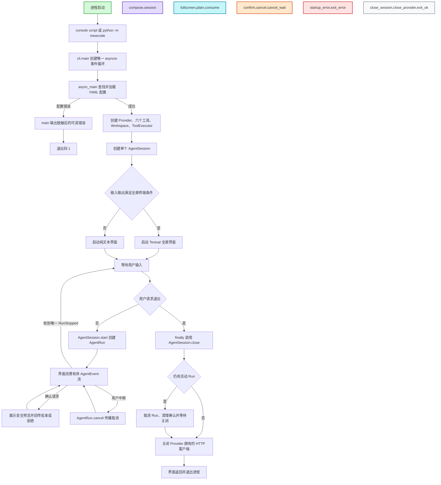
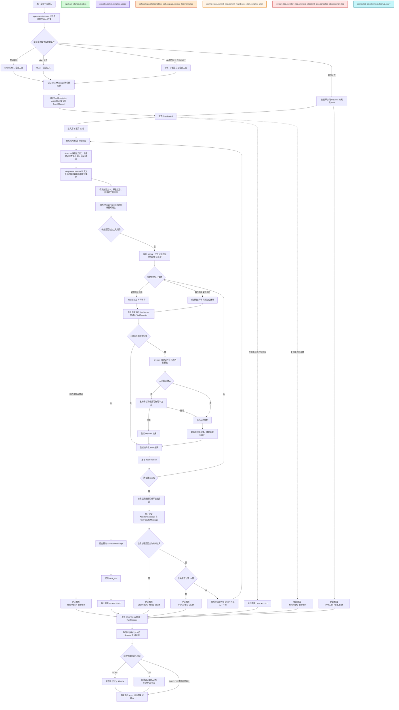

# MewCode 架构文档

> 审查基线：2026-07-17，`main` 分支 `a1e9139`。本文描述当前代码的实际行为，
> 不是未来设计稿。历史里程碑的需求与设计记录仍保留在 `docs/01-*` 至
> `docs/04-*` 目录中。

## 1. 系统定位

MewCode 是一个单进程、单异步事件循环的 Python 3.13 终端 Agent。进程启动后
创建一个 `AgentSession`；会话可依次接受多个用户请求，但同一时刻只允许一个
`AgentRun`。一次 `AgentRun` 最多包含 10 轮“模型响应 -> 工具执行 -> 结果回写”，
因此“一次任务”不等同于“一次模型 HTTP 请求”。

当前系统具备以下核心特征：

- 同时支持 OpenAI Responses API 与 Anthropic Messages API，并在 Provider 边界
  统一为异步事件流。
- 同时支持 Textual 全屏界面与纯文本界面，两者消费同一组 `AgentEvent`，不参与
  Agent 内部调度。
- 支持普通执行、`/plan <task>` 只读规划、`/do` 执行已保存计划三种模式。
- 内置读取、写入、编辑、命令、文件枚举和代码搜索六个工具；只读工具可以并行，
  副作用工具串行并逐次请求用户确认。
- 会话历史、计划、运行进度和 Token 用量只存在内存中，退出进程后不恢复。

## 2. 架构分层

| 层次 | 主要模块 | 职责 |
| --- | --- | --- |
| 入口与组合根 | `mewcode/cli.py`、`mewcode/__main__.py` | 创建唯一事件循环，加载配置，组装 Provider、工具、会话和界面，统一关闭资源 |
| 交互层 | `mewcode/tui/` | 收集用户输入，渲染事件，发回取消和确认决定；不直接调用 Provider 或具体工具 |
| 会话层 | `mewcode/agent/session.py` | 解析运行模式，持有历史、当前计划和活动 Run，保证单 Run 约束 |
| 单次运行层 | `mewcode/agent/run.py` | 驱动多轮 Agent Loop，累计用量，控制停止条件，提交完整历史事务 |
| 响应与调度层 | `mewcode/agent/collector.py`、`scheduler.py`、`control.py` | 收集模型流、组装工具调用、构建并发批次、管理确认、事件排序与背压 |
| Provider 适配层 | `mewcode/providers/` | 序列化历史和工具定义，访问远端 SSE API，将协议事件归一化 |
| 工具层 | `mewcode/tools/` | 注册工具，校验参数，约束工作区，准备和执行动作，处理确认、超时、截断与脱敏 |
| 共享领域类型 | `messages.py`、`cancellation.py`、`errors.py` | 定义跨层消息、协作式取消和可展示错误 |

### 2.1 依赖方向

依赖从入口向内核和适配器单向流动：

```text
cli
├── tui ───────────────→ agent 公共接口
├── agent ─────────────→ Provider 抽象 + tools 公共接口
├── Provider 具体实现 ─→ Provider 基础类型 + messages + tools.base
└── tools 具体实现 ────→ tools.base + workspace + cancellation
```

关键约束如下：

- `mewcode.cli` 是唯一组合根，具体 Provider 和具体界面只在这里选择。
- Provider 不导入 Agent、TUI 或 CLI；Provider 只负责协议转换。
- 工具执行器不依赖界面；确认通过 `AgentRun` 的公共控制入口完成。
- TUI 不读取 Collector、Scheduler 或事件通道内部状态，只消费公共事件。
- `messages`、`tools.base` 和 `cancellation` 提供跨模块协议，避免反向依赖。

### 2.2 状态所有权

| 所有者 | 持有状态 | 生命周期 |
| --- | --- | --- |
| `AgentSession` | 完整对话历史、当前计划、当前活动 Run | CLI 启动到退出 |
| `AgentRun` | `run_id`、当前轮次、累计用量、未知工具连续计数、取消令牌、待确认请求 | 单次用户请求 |
| `EventChannel` | 全局事件序号、有界队列、终止标记、单消费者声明 | 单个 `AgentRun` |
| Provider | HTTP 客户端和 Provider 配置 | `AgentSession` 生命周期 |
| TUI | 当前草稿、展示组件、活动 Run 的展示引用 | 界面生命周期 |

## 3. 程序控制流生命周期

下图覆盖从命令启动、依赖组装、界面选择、重复处理请求，到取消活动任务并关闭
Provider 的完整进程生命周期。



### 3.1 启动阶段

1. `main()` 只调用一次 `asyncio.run()`，全屏和纯文本路径共享同一个异步运行时。
2. 配置默认按 `./.mewcode/config.yaml`、`~/.mewcode/config.yaml` 的顺序查找；
   项目级配置优先。
3. `create_provider()` 根据 `protocol` 创建 OpenAI 或 Anthropic 适配器。
4. 默认注册表创建六个工具。`Workspace` 固定为启动时的 `Path.cwd()`；
   `ToolExecutor` 同时接收输出上限和 API key 脱敏词。
5. 只有标准输入、标准输出都是原始 TTY，且没有注入测试流时才进入全屏模式；
   其他情况使用可管道化的纯文本模式。

### 3.2 运行与退出阶段

- 两种界面都调用 `AgentSession.start()`，随后异步迭代 `AgentRun`；核心行为不因
  界面变化而改变。
- 界面只在 `ConfirmationRequested` 时回传决定，在用户中断时调用 `cancel()`。
- 每个 Run 结束后会话回到可接收输入状态；不存在请求队列或并行 Run。
- `async_main()` 的 `finally` 始终关闭 Session。关闭操作会先取消活动 Run、等待其
  完成清理，再且仅再关闭一次 Provider。

## 4. 单次任务执行流程

这里的“单次任务”指一次 `AgentSession.start()` 返回的 `AgentRun`。它可能包含多次
Provider 请求和多批工具执行。



### 4.1 请求模式

| 输入 | `RunMode` | 模型看到的用户正文 | 工具范围 | 计划状态要求 |
| --- | --- | --- | --- | --- |
| 普通文本 | `EXECUTE` | 原始输入 | 全部六个工具 | 无 |
| `/plan <task>` | `PLAN` | 去掉命令前缀后的任务 | `read_file`、`glob_files`、`search_code` | 任务不能为空 |
| `/do` | `DO` | 当前计划正文 | 全部六个工具 | 必须存在 `READY` 计划 |

无效的 `/plan` 或 `/do` 仍会产生 `RunStarted` 和 `RunStopped`，从而让所有消费者
维持同一种生命周期协议；但它不会提交用户消息，也不会访问 Provider 或工具。

### 4.2 模型响应收集

Provider 对外实现统一的 `LLMProvider` 协议：

```python
stream_response(history, tools, *, instructions, cancellation)
    -> AsyncIterator[ProviderEvent]
```

`ResponseCollector` 将具体协议转换为三类输入：

- `ProviderTextDelta`：立即发布为 `TextDeltaEvent`，同时累积完整助手文本。
- `ProviderToolCallDelta`：按稳定槽位拼接调用 ID、名称和 JSON 参数。
- `ProviderResponseCompleted`：携带 Provider 原生状态和真实 Token 用量。

只有收到恰好一个完成事件，且流在完成事件后没有额外内容时，本轮才被视为完整。
缺少完成事件、重复完成、重复调用 ID 或不稳定槽位都会成为 `ProviderError`，终止
当前 Run。Provider 原生助手状态只保存在 `AssistantMessage` 中，供同一 Provider
精确重放，不暴露给 Agent 事件消费者。

### 4.3 工具调度与执行

| 工具 | 访问性质 | 执行策略 | 用户确认 |
| --- | --- | --- | --- |
| `read_file` | 只读 | 可并行 | 否 |
| `glob_files` | 只读 | 可并行 | 否 |
| `search_code` | 只读 | 可并行 | 否 |
| `write_file` | 副作用 | 串行 | 是 |
| `edit_file` | 副作用 | 串行 | 是 |
| `run_command` | 副作用 | 串行 | 是 |

调度器只把相邻的 `PARALLEL_SAFE` 调用放进同一个 `TaskGroup`。任何串行调用都会
先刷新前面的并行批次，并阻止后续调用越过它。工具开始和完成事件可以反映真实
并发顺序，但反馈最终按模型原始位置排序，避免调用 ID 与结果错配。

`ToolExecutor` 集中完成以下工作：

1. 查询工具并使用 JSON Schema Draft 2020-12 校验参数。
2. 创建带工作区、Deadline、输出上限和取消令牌的 `ToolContext`。
3. 调用 `prepare()`，对副作用动作生成并脱敏确认预览。
4. 在批准后调用 `execute()`；拒绝、超时和普通工具异常都转换为 `ToolResult`。
5. 对结果和错误再次脱敏，记录耗时，并截断过大的文本、路径或匹配集合。

未知工具、无效参数、拒绝、超时和普通执行失败是模型可观察的结构化反馈，不会
直接终止 Agent Loop。只有取消、Provider 错误或未预期的内部异常会中断当前轮次。

## 5. 事件、并发与背压

`AgentRun` 是一个单消费者异步事件源。公开事件包括：

| 事件 | 含义 |
| --- | --- |
| `RunStarted` | Run 身份、模式、迭代上限和来源计划 |
| `ProgressChanged` | 等待模型、模型流、工具执行、确认等待、结果回写或停止 |
| `TextDeltaEvent` | 可立即展示的模型文本增量 |
| `ToolStarted` / `ToolFinished` | 安全的工具摘要、策略、状态、耗时和截断信息 |
| `ConfirmationRequested` / `ConfirmationResolved` | 副作用动作的确认闭环 |
| `UsageReported` | 本轮和累计 Token 用量；缺失维度保持未知，不估算 |
| `RunStopped` | 唯一终止事件及机器可判定的停止原因 |

每个事件带 `EventContext(run_id, sequence, iteration)`。`EventChannel` 在发布时统一
分配严格递增的 `sequence`，普通事件默认只有 64 个在途槽位；慢消费者会向生产者
施加背压。队列额外保留停止前奏和终止事件容量，因此即使普通槽位已满也能结束。

通道只允许声明一个消费者。消费者在看到终止事件前关闭迭代器，会触发 Run 取消；
终止后发布的迟到事件会被拒绝。这个边界保证全屏 TUI、纯文本 TUI 和测试消费者
观察到同一个有序协议，而不是各自驱动业务逻辑。

## 6. 历史与计划的一致性

### 6.1 历史提交边界

- 有效请求开始时，`UserMessage` 先进入 Session 历史。
- 无工具的完整响应只提交一个 `AssistantMessage`。
- 有工具的完整轮次把 `AssistantMessage` 与对应 `ToolResultsMessage` 作为一个事务
  提交；下一轮只读取已经完整提交的历史。
- 模型流中断、Provider 错误或工具批次中途取消时，不提交当前不完整的助手/工具
  事务；之前已完成的轮次和最初用户消息仍保留。
- 取消不是副作用回滚机制。已经启动的文件替换或命令可能已经产生外部效果，即使
  当前历史事务最终没有提交。

### 6.2 计划生命周期

- `/plan` 只有以 `COMPLETED` 自然结束时，才用最终文本创建新的 `READY` 计划。
- 规划被取消、达到迭代上限、连续未知工具或 Provider 失败时，旧计划保持不变。
- `/do` 运行期间计划仍为 `READY`；只有自然完成才标记为 `COMPLETED`。
- `/do` 的其他停止原因允许重试同一个计划；已完成计划不能再次执行。
- 普通 `EXECUTE` 请求不改变计划状态。

## 7. 停止与清理语义

| `StopReason` | 触发条件 | 当前轮历史 |
| --- | --- | --- |
| `COMPLETED` | 完整响应不含工具调用 | 提交最终助手消息 |
| `ITERATION_LIMIT` | 第 10 轮工具批次完整结束 | 提交第 10 轮助手和工具反馈 |
| `UNKNOWN_TOOL_LIMIT` | 连续三轮全部调用未知工具 | 提交触发停止的完整反馈 |
| `CANCELLED` | 用户取消、Session 关闭或消费者提前离开 | 不提交当前不完整事务 |
| `PROVIDER_ERROR` | 网络、SSE 或 Provider 完成协议错误 | 不提交当前不完整响应 |
| `INVALID_REQUEST` | `/plan` 或 `/do` 前置条件不满足 | 不访问 Provider，不提交输入 |
| `INTERNAL_ERROR` | 未预期的内部异常 | 取消剩余工作并安全终止 |

所有路径最终都通过 `EventChannel.stop()` 发布可选的 `STOPPING` 进度和恰好一个
`RunStopped`。`finally` 会取消所有未决确认，并调用 Session 回调清除活动 Run；
Session 退出时还会等待 Run 关闭和释放 Provider HTTP 资源。

## 8. 安全边界

- 文件路径必须落在启动工作区内，拒绝绝对路径、`..` 和符号链接逃逸。
- `write_file`、`edit_file` 和 `run_command` 每次都需要确认，没有自动批准策略。
- API key 会从 Provider 错误、工具参数摘要、确认预览、结果和错误中脱敏。
- 完整工具结果只进入模型反馈；界面事件只携带有限的安全展示字段。
- 工具具有超时、取消检查和输出上限；文件替换使用原子写入路径。
- `run_command` 没有操作系统级沙箱，拥有与 MewCode 进程相同的系统权限。确认是
  当前主要的副作用控制边界。

## 9. 扩展点与当前边界

### 9.1 扩展点

- **新增 Provider：** 实现 `LLMProvider.stream_response()` 和 `aclose()`，并把原生
  协议映射为统一 Provider 事件。
- **新增工具：** 实现 `Tool` 协议，声明 Schema、访问性质、执行策略和确认要求，
  再注册到组合根使用的 `ToolRegistry`。
- **新增界面：** 只依赖 `AgentSession`、`AgentRun` 和 `AgentEvent`；通过公共接口
  回传取消与确认，不接触内部调度器。
- **替换状态存储：** 当前状态集中在 `AgentSession`，未来持久化可从会话历史和
  `StoredPlan` 的存取边界切入。

### 9.2 当前明确不包含

- 多 Agent 或子 Agent 调度。
- 会话、计划、Token 或检查点持久化。
- 上下文压缩、恢复和跨 Provider 迁移。
- 可配置权限策略、自动批准或操作系统级沙箱。
- 请求排队、并行 Run、运行中 steering 或后台任务恢复。

## 10. 关键源码索引

- 进程组合与资源关闭：[`mewcode/cli.py`](../mewcode/cli.py)
- 配置查找与校验：[`mewcode/config.py`](../mewcode/config.py)
- 会话与 Plan/Do 生命周期：[`mewcode/agent/session.py`](../mewcode/agent/session.py)
- 单次 Agent Loop：[`mewcode/agent/run.py`](../mewcode/agent/run.py)
- Provider 流收集：[`mewcode/agent/collector.py`](../mewcode/agent/collector.py)
- 工具批次与顺序：[`mewcode/agent/scheduler.py`](../mewcode/agent/scheduler.py)
- 事件通道与确认：[`mewcode/agent/control.py`](../mewcode/agent/control.py)
- 公共事件契约：[`mewcode/agent/events.py`](../mewcode/agent/events.py)
- Provider 抽象与适配器：[`mewcode/providers/`](../mewcode/providers)
- 工具协议、注册和执行：[`mewcode/tools/`](../mewcode/tools)
- 全屏与纯文本消费者：[`mewcode/tui/`](../mewcode/tui)
